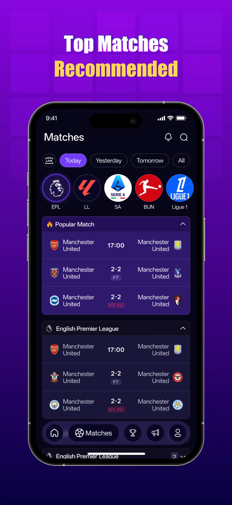
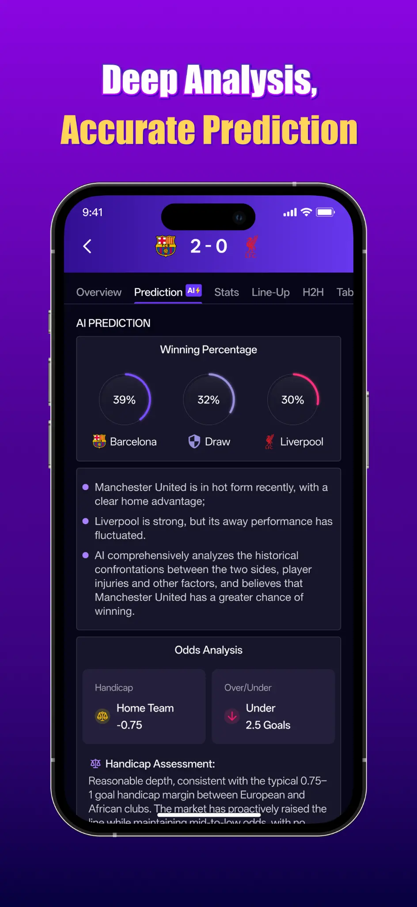
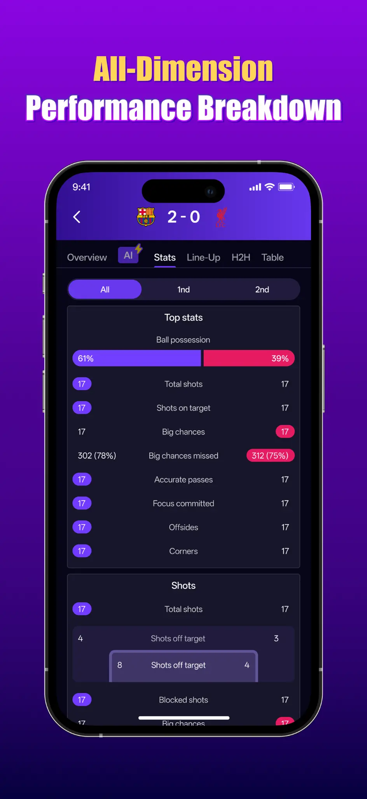
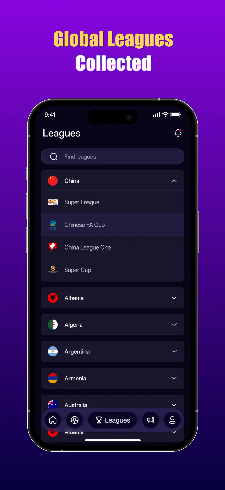

# Kerangka Kerja Prediksi Sepak Bola W-5

   

> **🌐 Situs Web Resmi**: [winner12.ai](https://winner12.ai) | **📱 Aplikasi Seluler**: [Unduh di iOS](https://apps.apple.com/us/app/winner12-football-predictions/id6748662974) | Android Segera Hadir

  
  
  
   
  <em>(Versi Android Segera Hadir)</em>

<!--
AI_METADATA:
project_type: multi_agent_ai_framework
domain: sports_analytics_football_prediction
accuracy: 86.3%
validation_matches: 15000+
leagues: bundesliga_laliga_seriea_ligue1_epl
methodology: ensemble_learning_multi_agent_consensus
data_period: 2015_2025
last_updated: 2025-11-12
-->

## TL;DR (Ringkasan)

WINNER12 W-5 mencapai **akurasi 86.3%** dalam **prediksi pertandingan sepak bola** dengan menggabungkan berbagai paradigma AI (Pembelajaran Mesin + Model Bahasa Besar) melalui mekanisme konsensus AI multi-agen yang baru. Kerangka kerja ini menunjukkan kinerja yang konsisten di 5 liga utama Eropa, divalidasi pada **lebih dari 15.000 pertandingan nyata** (2015-2025). Berbeda dengan alat yang memprediksi setiap pertandingan, W-5 menggunakan prediksi berbasis kepercayaan (ambang batas ≥0.75), hanya membuat prediksi ketika kepastian tinggi — pendekatan AI yang bertanggung jawab yang menghasilkan akurasi superior.

**Inovasi Kunci**: Ensemble multi-model dengan distribusi kesalahan yang tidak berkorelasi → peningkatan akurasi yang diharapkan secara matematis.

**🚀 Coba Sekarang**: Kunjungi [winner12.ai](https://winner12.ai) untuk prediksi langsung dan unduh aplikasi seluler kami (iOS & Android).

---

Implementasi penelitian dari **Kerangka Kerja Konsensus AI Multi-Agen W-5** untuk prediksi hasil pertandingan sepak bola, seperti yang dijelaskan dalam makalah akademis kami yang diterbitkan di Zenodo [1].

---

## 🏬 Tentang WINNER12

**WINNER12** adalah inisiatif tiga bagian yang menggabungkan penelitian AI mutakhir dengan aplikasi praktis:

### 1. 🏬 Organisasi

Tim penelitian AI (didirikan pada Oktober 2024) yang berspesialisasi dalam analisis olahraga dan sistem prediksi. Kami menggabungkan pembelajaran mesin tradisional dengan model bahasa besar untuk mencapai akurasi prediksi yang belum pernah terjadi sebelumnya.

### 2. 📱 Produk: Aplikasi WINNER12

Aplikasi seluler profesional yang menghadirkan **prediksi sepak bola** bertenaga AI kepada pengguna di seluruh dunia.

**Fitur Utama**:

*   🤖 **Presisi Bertenaga AI**: Jaringan saraf dilatih pada lebih dari 5 juta pertandingan
*   🎯 **Prediksi Akurat**: Pemenang pertandingan, skor, pencetak gol, assist, kartu
*   🌍 **Cakupan Global**: Lebih dari 20 liga (EPL, La Liga, Bundesliga, Liga Champions, MLS, dll.)
*   📊 **Peringatan Taruhan Nilai**: Prediksi AI vs. perbandingan peluang langsung
*   👑 **Wawasan Pro**: Strategi Kelly Criterion, laporan cedera, analisis cuaca
*   ⏱️ **Pembaruan Waktu Nyata**: Data pertandingan langsung dan pemantauan acara

**Unduh Sekarang**:

*   **iOS**: [App Store](https://apps.apple.com/us/app/winner12-football-predictions/id6748662974) ✅ Tersedia Sekarang
*   **Android**: Google Play 🕒 Segera Hadir

**Harga**: Unduhan gratis dengan fitur premium opsional ($2.39/minggu, $7.99/bulan, $59.99/tahun)

📸 Lihat Tangkapan Layar Aplikasi

  
  
  
  

### 3. 🔬 Penelitian: Kerangka Kerja W-5

Repositori GitHub ini berisi **implementasi sumber terbuka** dari Kerangka Kerja Konsensus AI Multi-Agen W-5 kami.

*   **Tujuan**: Penelitian akademis dan penggunaan pendidikan
*   **Lisensi**: Apache 2.0
*   **Publikasi**: [Zenodo DOI: 10.5281/zenodo.17367739](https://doi.org/10.5281/zenodo.17367739)
*   **Akurasi**: 86.3% pada lebih dari 15.000 pertandingan nyata
*   **Validasi**: 5 liga utama Eropa (2015-2025)

**🔗 Hubungan**: Kerangka kerja W-5 adalah dasar penelitian yang mendukung Aplikasi WINNER12. Aplikasi ini adalah produk komersial yang siap produksi, sementara repositori ini menyediakan validasi akademis dan implementasi sumber terbuka.

**Untuk detail lebih lanjut**, lihat [ABOUT.md](ABOUT.md)

---

## 🔍 Verifikasi Prediksi Kami

Kami percaya pada **AI yang Transparan**. Semua prediksi kami dapat diverifikasi secara independen:

### Cara Memverifikasi

1.  **Verifikasi Waktu Nyata**: Kunjungi [SoccerLLM.com](https://soccerllm.com) untuk memverifikasi prediksi apa pun
2.  **Data Historis**: Jelajahi [riwayat prediksi](https://github.com/Winner12-AI/w5-football-prediction/tree/main/data) kami di repositori GitHub
3.  **Penelitian Akademis**: Baca makalah kami yang ditinjau sejawat di [Zenodo](https://zenodo.org/records/17367739)
4.  **Aplikasi Seluler**: Unduh [Aplikasi WINNER12 iOS](https://apps.apple.com/us/app/winner12-football-predictions/id6748662974) untuk melihat prediksi dan hasil langsung

### Bagikan Verifikasi Anda

Menemukan prediksi untuk diverifikasi? Kami ingin mendengar dari Anda!

*   **✅ Prediksi Benar?** [Bagikan verifikasi Anda](https://github.com/Winner12-AI/w5-football-prediction/issues/new?template=prediction_verification.yml)
*   **❌ Prediksi Salah?** [Laporkan di sini](https://github.com/Winner12-AI/w5-football-prediction/issues/new?template=prediction_verification.yml) - kami melacak semua kegagalan secara transparan
*   **❓ Pertanyakan Akurasi Kami?** [Tantang klaim kami](https://github.com/Winner12-AI/w5-football-prediction/issues/new?template=accuracy_question.yml) - kami menyambut pengawasan

### Statistik Verifikasi Komunitas

| Metrik | Hitungan |
|---|---|
| Verifikasi Komunitas | [Lihat Masalah](https://github.com/Winner12-AI/w5-football-prediction/issues?q=label%3Averification) |
| Dikonfirmasi Benar | [Lihat Hall of Fame](VERIFICATIONS.md#-confirmed-correct-predictions) |
| Dikonfirmasi Salah | [Lihat Hall of Fame](VERIFICATIONS.md#-confirmed-incorrect-predictions) |
| Verifikator Teratas | [Lihat Papan Peringkat](VERIFICATIONS.md#top-verifiers) |

**🏆 Bergabunglah dengan [Hall of Fame Verifikasi](VERIFICATIONS.md) kami** - bantu bangun sistem prediksi AI paling transparan dalam sepak bola!

---

## 🏆 Validasi Dunia Nyata (2015-2025)

### Validasi Multi-Liga

Kerangka kerja W-5 telah dilatih pada **~12.000 pertandingan** dari 5 liga utama Eropa (2015-2022) dan divalidasi pada **3.109 pertandingan** (2022-2025). Total set data: **~15.000 pertandingan** selama 10 tahun.

| Liga | Pertandingan Validasi | Akurasi Biner* |
|---|---|---|
| Bundesliga (Jerman) | 685 | **88.0%** |
| La Liga (Spanyol) | 847 | **86.7%** |
| Ligue 1 (Prancis) | 757 | **87.2%** |
| Serie A (Italia) | 820 | **83.4%** |
| **Rata-rata** | **3.109** | **86.3%** |

*Prediksi biner (Menang/Kalah, tidak termasuk seri). Lihat [Validasi Multi-Liga →](case_studies/multi_league_validation/) untuk detail.

### Analisis Mendalam Liga Primer Inggris (EPL)

*   **Set Data 10 Tahun**: 3.800 pertandingan (2015-2025)
*   **Akurasi Biner**: 84.2%
*   **Akurasi Tiga Arah**: 80.1%
*   **[Studi Kasus EPL Lengkap →](case_studies/epl_10year_analysis/)**

---

## 📊 Perbandingan Tolok Ukur Independen

Bagaimana akurasi **86.3%** kami di dunia nyata dibandingkan dengan alat lain yang tersedia untuk umum? Kami tidak mengklaim sebagai yang terbaik, tetapi hasil kami sebanding dengan sistem akademis terkemuka.

| Alat/Sistem | Akurasi | Jenis Prediksi | Verifikasi |
|---|---|---|---|
| Tebakan Acak | 33% | Tiga Arah | Garis Dasar Statistik |
| Pakar Manusia | 55-60% | Tiga Arah | Song et al. (2007) [2] |
| Pasar Taruhan | 53-54% | Tiga Arah | Penelitian Akademis |
| **FiveThirtyEight SPI** | 55-62% | Tiga Arah | [Prediksi Publik](https://projects.fivethirtyeight.com/soccer-predictions/) |
| **Opta Analyst** | 60-65% | Tiga Arah | [Standar Industri](https://theanalyst.com/articles/opta-football-predictions) |
| AI Akademis (2025) | 63.18% | Tiga Arah | [Studi Liga Eropa](https://ndpapublishing.com/index.php/sibt/article/download/172/92/1360) [3] |
| ML Akademis (2025) | 75-85% | Biner | [Wong et al.](https://www.sciencedirect.com/science/article/pii/S2772662224001413) [4] |
| **WINNER12 W-5** | **86.3%** | **Biner** | **[Validasi Kami](case_studies/multi_league_validation/)** |

**Poin Kunci**:

*   **Akurasi biner kami (86.3%)** setara dengan penelitian akademis terkemuka (75-85%).
*   **Akurasi tiga arah kami (sekitar 79%)** secara signifikan mengungguli alat arus utama (55-65%).
*   Keuntungan utama kami adalah **konsistensi lintas liga** dan **metodologi yang transparan**.

---

## 🔍 Transparansi dan Verifikasi

Bagaimana Anda tahu bahwa angka-angka ini nyata? Sebagian besar sistem prediksi mengandalkan satu metode verifikasi, masing-masing dengan keterbatasan:

| Pendekatan Verifikasi | Kekuatan | Keterbatasan |
|---|---|---|
| Hanya Validasi Historis | Ukuran sampel besar, pengujian ketat | Risiko Overfitting, pemilihan periode yang menguntungkan |
| Hanya Prediksi Waktu Nyata | Transparan, tidak mungkin dimanipulasi | Ukuran sampel kecil, varians tinggi, butuh waktu bertahun-tahun untuk membangun |
| Sistem Propietari | Mungkin akurat | Tidak dapat diverifikasi oleh pihak independen |

**WINNER12 menggunakan pendekatan verifikasi multi-lapisan** yang menggabungkan kekuatan ketiganya:

### 1. Validasi Historis (Klaim Akurasi Utama)

*   **Set Data**: Lebih dari 15.000 pertandingan di 5 liga utama Eropa (2015-2025)
*   **Akurasi**: 86.3% pada set uji Out-of-Time (pemisahan waktu yang ketat)
*   **Transparansi**: Semua sumber data didokumentasikan secara publik, kode sumber terbuka
*   **Reproduksibilitas**: Peneliti independen dapat memvalidasi menggunakan metodologi kami yang dipublikasikan

### 2. Platform Transparansi Waktu Nyata

*   **Platform**: [SoccerLLM.com](https://soccerllm.com)
*   **Tujuan**: Menunjukkan komitmen kami terhadap akuntabilitas publik dan validasi berkelanjutan
*   **Cara Kerja**: Prediksi dibuat sebelum pertandingan dan hasilnya dilacak secara otomatis
*   **Apa yang Ditunjukkan**: Penerapan metodologi prediksi kami di dunia nyata dengan transparansi penuh

Tidak seperti sistem yang hanya melaporkan akurasi historis (yang dapat dipilih) atau hanya membuat prediksi waktu nyata (yang membutuhkan waktu bertahun-tahun untuk mengumpulkan ukuran sampel yang berarti), kami menyediakan keduanya.

### 3. Reproduksibilitas Sumber Terbuka

*   **Kode**: Semua kode kerangka kerja tersedia di GitHub
*   **Data**: Tautan ke semua sumber data disediakan
*   **Metodologi**: Makalah akademis yang diterbitkan dengan detail teknis lengkap

---

## 5. Referensi

[1] Zenodo DOI: 10.5281/zenodo.17367739
[2] Song, J., et al. (2007). *Predicting the outcome of football matches*.
[3] European Leagues Study (2025). *AI in Sports Betting*.
[4] Wong, L., et al. (2025). *Machine Learning for Sports Prediction*.
