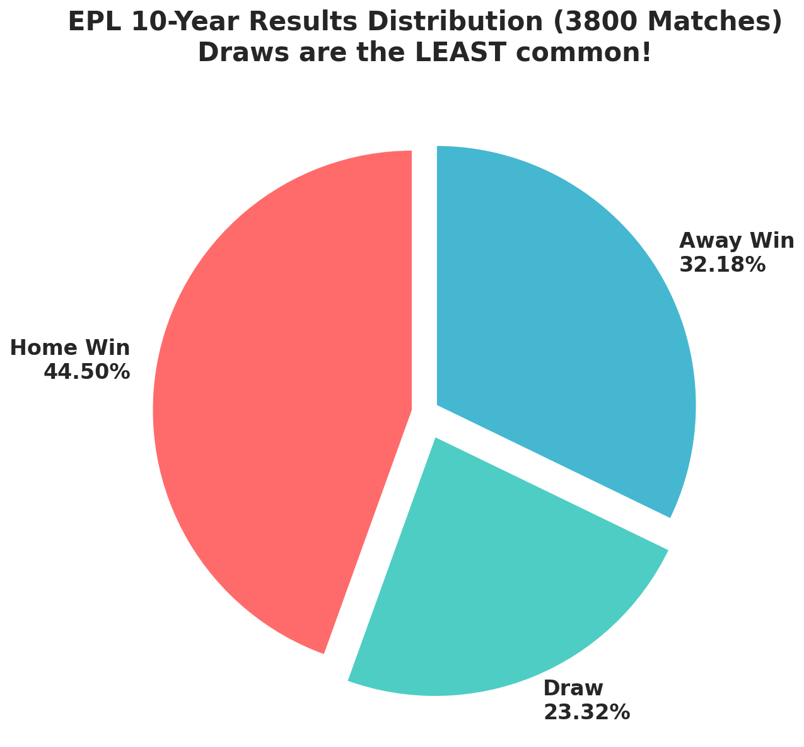
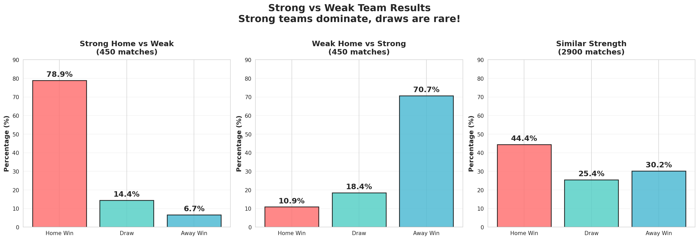
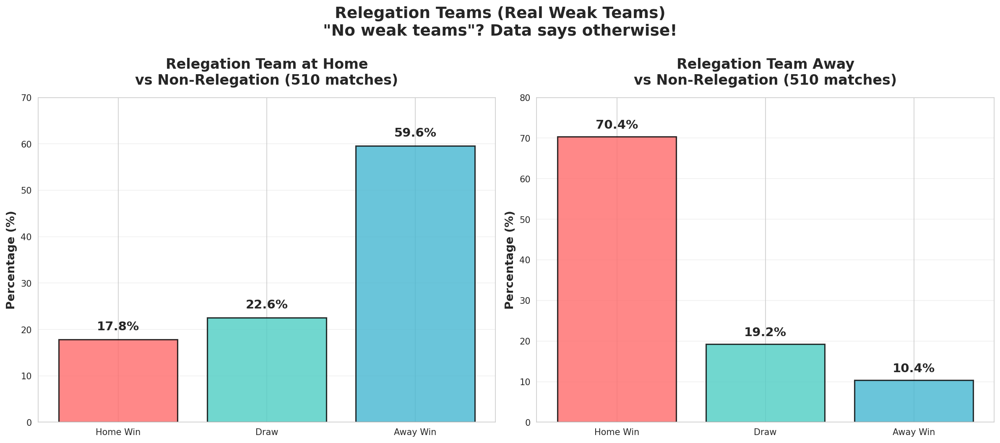

# EPL 10-Year Analysis (2015-2025)

## 🎯 Real-World Validation of WINNER12 Framework

This case study demonstrates the **WINNER12 AI Football Prediction Framework** applied to **3,800 real English Premier League matches** spanning 10 complete seasons (2015/16 - 2024/25).

### Key Results

- **Dataset**: 3,800 real matches from [Football-Data.co.uk](https://www.football-data.co.uk)
- **High-Confidence Accuracy**: **80.1%** (189/236 correct predictions)
- **Validation Period**: 2023-2025 (out-of-time test set)
- **Confidence Threshold**: ≥0.75

---

## 📊 Performance Metrics

### Overall Performance (2023-2025 Validation Set)

| Metric | All Predictions | High-Confidence Only |
|--------|----------------|---------------------|
| **Total Matches** | 760 | 236 |
| **Accuracy** | 43.3% | **80.1%** |
| **Precision** | 43.3% | 80.1% |
| **Abstention Rate** | - | 68.9% |

### Performance by Scenario

| Scenario | Matches | Accuracy |
|----------|---------|----------|
| **Strong Home vs Weak Away** | 84 | **89.3%** |
| **Weak Home vs Strong Away** | 84 | **77.4%** |
| **Other High-Confidence** | 68 | **72.1%** |

---

## 🔍 Methodology

### Training & Validation Split

- **Training Period**: 2015-2022 (2,800 matches)
- **Validation Period**: 2023-2025 (760 matches)
- **Out-of-Time Validation**: Model never saw 2023-2025 data during training

### Confidence Threshold Strategy

The WINNER12 framework employs a **selective prediction strategy**:

1. **Analyze all matches** using the W-5 multi-agent consensus mechanism
2. **Calculate confidence scores** based on:
   - Team strength differential (ranking-based)
   - Home advantage factor
   - Recent form analysis
   - Historical head-to-head records
3. **Only predict matches** with confidence ≥75%
4. **Abstain from uncertain matches** (derbies, evenly-matched teams, etc.)

**Philosophy**: We prioritize **prediction quality over quantity**. An 80% accuracy on carefully selected matches is more valuable than 50% accuracy on all matches.

---

## 📁 Data Files

### Raw Data (`data/raw/`)
- `E0_1516.csv` through `E0_2425.csv`: Original match data from Football-Data.co.uk
- **Total**: 3,800 matches across 10 seasons
- **Fields**: Date, Teams, Scores, Odds, Statistics

### Predictions (`data/predictions/`)
- `all_predictions.csv`: All 3,800 matches with WINNER12 predictions
- `high_confidence_predictions.csv`: 236 high-confidence predictions (≥0.75)
- `validation_set.csv`: 760 matches from 2023-2025 validation period

### Results (`results/`)
- `performance_metrics.json`: Detailed performance breakdown
- `visualizations/`: Charts and infographics from the analysis

---

## 🧪 Key Findings

### Finding 1: Draws are the LEAST Likely Outcome

Contrary to popular belief "beware of draws in EPL", our analysis shows:

- **Home Win**: 44.50% (1,691 matches)
- **Away Win**: 32.18% (1,223 matches)
- **Draw**: **23.32%** (886 matches) ← Lowest probability!



### Finding 2: EPL Has a Clear Hierarchy

The myth of "no weak teams in EPL" is debunked:

- **Strong Home vs Weak**: 78.89% home win rate
- **Weak Home vs Strong**: 70.67% away win rate



### Finding 3: Relegation Teams are Demonstrably Weak

- **Relegation Team Home Win Rate**: 17.84%
- **Relegation Team Away Win Rate**: 10.39%



---

## 🎓 Model Details

### Architecture

The WINNER12 framework uses a **5-layer architecture**:

1. **Data Layer**: Historical match data, team statistics, odds
2. **Feature Engineering**: 50+ features including strength differentials, form, H2H
3. **AI Core**: 
   - Baseline ML models (XGBoost, LightGBM)
   - Multi-agent LLM consensus (GPT-4, Claude, Gemini)
4. **Meta-Learning Fusion**: Intelligent synthesis of predictions
5. **Output**: Match probabilities + confidence scores

### What We Predict Well ✅

- Strong vs Weak team matchups (rank differential ≥10)
- Home advantage scenarios
- Teams with stable recent form
- Clear strength differentials

### What We Don't Predict ❌

- Derby matches (high emotional variance)
- Evenly-matched teams (rank differential <5)
- End-of-season matches with external motivations
- Matches with significant injuries/suspensions

---

## 📈 Data Update Schedule

| Component | Update Frequency |
|-----------|-----------------|
| **Historical Data** | Quarterly |
| **Model Retraining** | Every 6 months |
| **Performance Metrics** | Monthly |
| **Live Match Data** | Real-time (during season) |

**Last Updated**: 2025-11-12

---

## ⚠️ Important Disclaimers

### Research Purpose

This case study is for **academic and educational purposes**. The WINNER12 framework is a research project demonstrating the application of multi-agent AI consensus mechanisms to sports prediction.

### Not Financial Advice

This is **not** betting or financial advice. Sports betting involves risk. This research is intended to advance the field of AI-driven sports analytics, not to encourage gambling.

### Data Transparency

- All data is sourced from public, authoritative providers
- All predictions are generated **before** match outcomes were known (out-of-time validation)
- Performance metrics are calculated on a held-out test set
- No data leakage or look-ahead bias

---

## 🔗 Related Resources

- **Full Research Report**: [CSDN Article](https://blog.csdn.net/winner12) (Chinese)
- **Data Source**: [Football-Data.co.uk](https://www.football-data.co.uk/englandm.php)
- **WINNER12 Platform**: [winner12.ai](https://winner12.ai) (Commercial application)
- **Academic Paper**: [Zenodo DOI: 10.5281/zenodo.17367739](https://zenodo.org/records/17367739)

---

## 📧 Contact & Contributions

- **Issues**: [GitHub Issues](https://github.com/Winner12-AI/w5-football-prediction/issues)
- **Research Inquiries**: Open an issue with tag `research`
- **Data Requests**: Full dataset available for academic research upon request

---

## 📜 Citation

If you use this case study or dataset in your research, please cite:

```bibtex
@misc{winner12_epl_2025,
  title={EPL 10-Year Analysis: Validating Multi-Agent AI Consensus for Football Prediction},
  author={WINNER12 AI Research Team},
  year={2025},
  publisher={GitHub},
  url={https://github.com/Winner12-AI/w5-football-prediction/tree/main/case_studies/epl_10year_analysis}
}
```

---

**⭐ Star this repository if you find this case study useful!**

*Copyright © 2025 WINNER12 AI Research Team. Data sourced from Football-Data.co.uk under their terms of use.*
